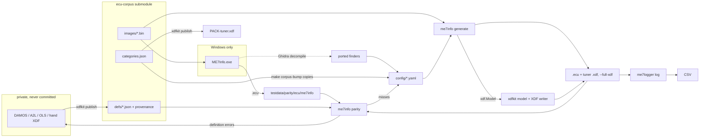

# Developer

## Workflow

Stage new originals in the gitignored `testdata/parity/incoming/`. Definitions are fixed and published in the corpus with xdfkit. A model from `me7info place` can be committed there with origin `located`. Corpus edits, `categories.json` included, are committed and pushed in the full clone `../ecu-corpus`, then pulled with `make corpus-bump`; `corpus/` is a read-only shallow submodule (xdfkit `docs/corpus.md`). ME7Info's `.ecu` output for each image is the only hard 100% oracle.

## Design

`me7info` (`generate`, `probe`, `parity`, `place`) and `me7logger` (`log`) share one Go module. `generate` and `me7logger` locate items in the image as `record.Item` and `record.Map`. The `.ecu` writer reads those. `xdf.Model` converts the maps to an xdfkit model (file offsets, raw values, provenance origin `located`), and xdfkit files it with `Tuner` or `Categorize` and writes the XDF. `parity` reads the corpus definitions with xdfkit `canon` and `model`. me7-logger imports xdfkit; xdfkit never imports me7-logger.

`me7info place ref.json ref.bin dst.bin` writes a model for the destination image (`-o`, or stdout). A body that still matches is kept. One code pointer, found once, moves the object. Anything else is omitted. Provenance is format `image`, origin `located`. The report on stderr is the kept, moved, and omitted counts.

The generator is a masked byte search plus a few opcodes (selector, case bounds, `EXTP`), not a disassembler. A Bosch name located by bytes is a row in `config/signatures.yaml`, never a literal in Go. A row should match a code layout, not one image; check it across the corpus.

Out of scope: `.kp`, OLS, DAMOS, WinOLS, ecuxplot, `mapdump`. Do not copy NefMoto `Communication/`.

## xdfkit

`go.mod` pins xdfkit; there is no committed `replace`. `make work` writes the gitignored `go.work` (`use . ../xdfkit`), so builds and tests use the sibling checkout. Before pushing a change that needs new xdfkit code, push xdfkit, then `make xdfkit-bump` (pins its `master` as a pseudo-version) and `make check-pinned` (builds and vets with `GOWORK=off`, as CI does; `make test` runs it), and fold `go.mod` and `go.sum` into the commit. Bump again after xdfkit history is rewritten. Releases should pin a tagged xdfkit; `make package` warns on a pseudo-version.

## Config

Each file in `config/` documents its fields in its header. `config/user/*.yaml` overlays them in filename order; a row of the same name replaces the shipped one, and `drop: true` removes a needle. `--user`/`ME7_USER` picks another directory. `config/examples/needles.yaml` is not loaded.

Files load from `config/` beside the executable (symlinks resolved) when present, else the embedded copy. `make build` mirrors `config/` into `build/config/` with `rsync --delete`, leaving `build/config/user/` alone, so edits reach `build/me7info` on the next build. `go run` and `go test` binaries have no `config/` beside them and use the embedded copy. `--core`, `--names`, `--meas`, `--map`, `--alias` (or `ME7_*`) replace one file.

Flags use pflag (`internal/cli`): a long name takes two hyphens (`--user`), its one-letter short name one (`-u`), and `-user` is an error.

`signatures.yaml` rows run top to bottom, and the first row that hits fills a name. Prepended axis counts become rows and columns only when they account for every byte up to the body; never invent a count of 1. Only named maps reach the XDF.

`config/categories.json` is the corpus `categories.json` (xdfkit `docs/corpus.md`), copied by `make corpus-bump`; a test fails when they differ. It files each XDF map under a category. The tuner XDF holds only its names plus the maps at their axis addresses; `--full-xdf` holds every named map, with the rest under `Other`. `--model` writes that full model as JSON for the corpus (`xdfkit` `publish/README.md`).

A constant at a table axis address becomes a 1d breakpoint curve with that axis's count and data, so xdfkit links the axis to it. That happens only when every axis there has the same shape, the image values strictly increase, and no other map starts inside the curve. Otherwise it stays a constant, and `probe --maps` lists it as `xdf: not a breakpoint curve`.

### Axes on an interpolator call

The body is R12, or R13 page plus R12 low bits. The column header is the first of: an R13 immediate; R15 page with R14 low bits; a RAM load of R14 or R13; the header immediate stored through R12 before `MOV [ram], R4`. A second header loaded near the call is the row; conflicting or missing rows stay unset for `ytable` to fill. A `CALLS` into segment 0 outside the flash image uses the row's own `interp`.

## Logging

KWP `$23` reads at 10400 baud, up to 254 contiguous bytes per request, 55 ms apart, so scattered addresses cut the sample rate. `SamplesPerSecond` is 1 to 50, default 10.

## Parity

Images are in the private [ecu-corpus](https://github.com/nyetlabs/ecu-corpus) submodule (`make corpus`, `make corpus-bump`); oracles are in `testdata/parity`, whose files document themselves. `XDFKIT_CORPUS` points elsewhere; `XDFKIT_REQUIRE_CORPUS=1` fails on a missing corpus.

`make parity` prints the report from shipped config only. `make test` fails only when an image is below 100% against its legacy `ecu/me7info/<image>.ecu`; every other score is coverage.

A name hits when it has an address and its listed axes. Each image's definition is its corpus model JSON. Fix definitions in the corpus, not here. `provenance.origin` `damos`/`a2l` is the reference, and a different address is a miss. `hand` or unset is an oracle only: disagreements still hit and are listed under `hand xdf disagrees`. `located` is read and left out of both sections.

The tier grade is the highest tier in `names/tuner.yaml` where every name hits or is in `names/absent.yaml`. An `any` family is one name: one member located, or every member absent. `confidence` is high for bodies under 16 cells or matching a peer in `datasets.yaml` within two cells or 3%, and low for zero bodies unless every peer is zero.

## Version

`git describe` is the version. Commit subjects use the `cliff.toml` prefixes.
